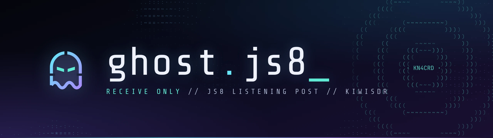
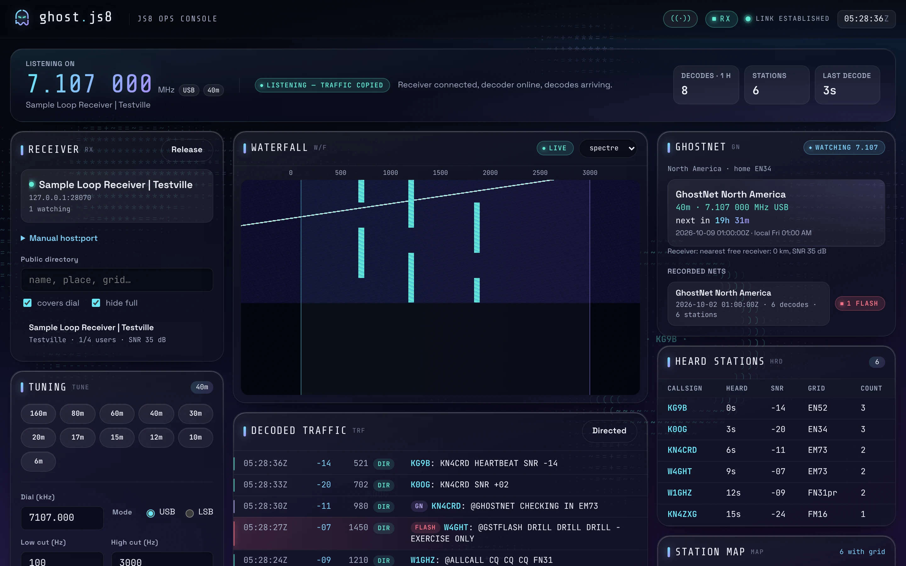

<p align="center">
  
</p>

<p align="center">
  <b>A JS8 ops console in the browser.</b><br>
  The native JS8Call decoder, headless in Docker, wired to public KiwiSDR receivers and GhostNet.
</p>

<p align="center">
  <a href="https://github.com/d3mocide/ghost.js8/actions/workflows/ci.yml"></a>
  
  
</p>

<p align="center">
  
</p>

## What it does

- **Real decoding.** KiwiSDR audio goes into native JS8Call. CI proves it end to end with a real recording.
- **Live console.** Waterfall, decoded traffic, heard stations, map and an audio monitor work on desktop and phone.
- **GhostNet autopilot (opt-in).** It follows your region's GhostNet JS8 nets on the nearest KiwiSDR. Each net is recorded (traffic, waterfall, audio) for later review. Live `@GSTFLASH` traffic raises an alert.
- **Truthful health.** Every component reports timestamped evidence. "Connected" is never mistaken for "decoding".
- **Polite on shared receivers.** It identifies itself, backs off on reconnect and never touches shared receiver settings.
- **RX today, built to grow.** Current builds have no transmit path (the UI shows an `RX` mode chip). Transmit is planned as a separate, explicitly enabled extension with proper radio tooling.

```
KiwiSDR ─ SND ─▶ bridge ─▶ decoder-agent ─▶ PulseAudio ─▶ JS8Call (native, headless)
        └ W/F ─▶ bridge ─▶ browser              JS8Call ─ UDP ─▶ agent ─▶ bridge ─▶ browser
```

## Quick start

```sh
git clone https://github.com/d3mocide/ghost.js8 && cd ghost.js8
cp .env.example .env          # set GHOSTJS8_ALLOWED_ORIGINS
docker compose up -d --build  # UI on http://127.0.0.1:8080
```

To monitor GhostNet unattended, add three lines to `.env` ([details](docs/ghostnet.md)):

```sh
GHOSTJS8_GHOSTNET=on
GHOSTJS8_GHOSTNET_REGION=na    # na | eu | aus
GHOSTJS8_HOME_GRID=EM73        # your Maidenhead grid
```

Put a reverse proxy in front for TLS and authentication ([operations](docs/operations.md)). Keep the host NTP-synced, because JS8 decoding depends on accurate time.

## Docs

[Architecture](docs/architecture.md) · [GhostNet](docs/ghostnet.md) · [Operations](docs/operations.md) · [Protocol](docs/protocol.md) · [KiwiSDR notes](docs/kiwisdr-notes.md) · [Decoder container](docs/decoder-container.md) · [Security updates](docs/SECURITY-UPDATES.md) · [Contributing / agents](AGENTS.md)

## Develop

Requires `uv`, Node 22, GNU make and Docker.

```sh
make setup        # pinned deps
make check        # lint, typecheck, unit tests (bridge + web)
make acceptance   # real-recording decode test (Docker)
make e2e          # Playwright against a simulated stack
```

For UI work without Docker, run `tools/dev-stack.sh` and `npm --prefix web run dev`. Add `GHOSTNET=1 SEED_NET=1` to the dev stack for a demo GhostNet recording.

## License

GPL-3.0-or-later. JS8Call (GPL-3.0) runs as a separate, unmodified process. The upstream test recording is fetched at test time, not redistributed. Map outlines are Natural Earth (public domain).

<sub>A d3FRAG Networks project. In the spirit of S2 Underground's GhostNet; not affiliated.</sub>
